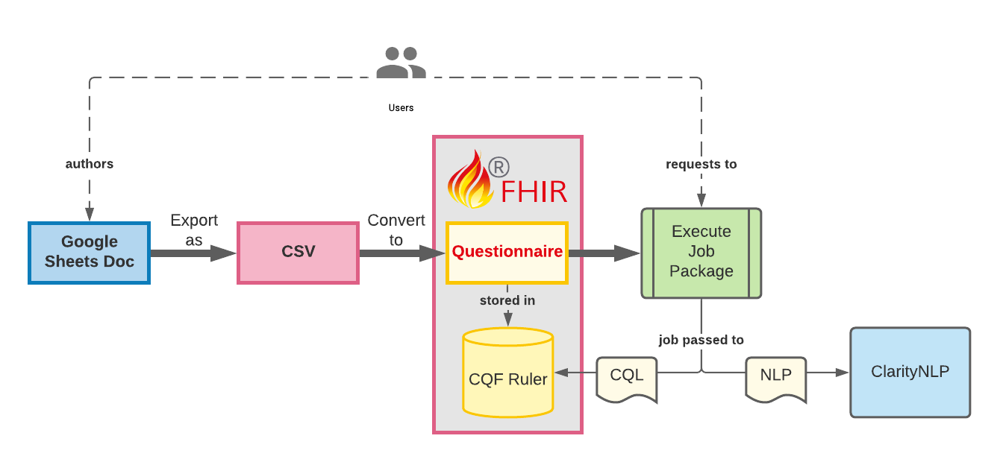

.. _authoring-job-packages:

Authoring Job Packages
======================

.. highlight:: none

Please Note: It is recommended to read over the Terminology page of this Wiki prior to this page.

Job Package Overview
--------------------

A Job Package is a collection of concepts with associated CQL or NLPQL scripts. A concept can be anything defined by a user (commonly, but not exclusively, stated as a clinical question) which is then answered by the specified scripts. Each execution is considered an individual “job” within the package. A Job Package is considered part of the input to the RC API system, generating an output consisting of a series of results based on the defined jobs.

For an example of a job, given a user specified concept of “Subject pregnant during condition onset” (or, “Was the subject pregnant during the condition's onset?”), a script may execute against a clinical record to attempt to identify whether there were overlapping dates between the two events of pregnancy and condition onset.

User Interface Definitions
~~~~~~~~~~~~~~~~~~~~~~~~~~

As Job Packages are built as FHIR Questionnaire resources, there is innate support for rendering in UIs, such as conditional displays or item (concept) categories. This is an optional feature, and whether or not a Job Package is defined with UI considerations will vary.

Job Package Lifecycle
---------------------

The following diagram is a simple view of a job package's lifecycle from authorship through the execution in CQF Ruler or ClarityNLP. (Please note that this does not demonstrate the full round trip through the system, as returned results are not displayed here.)

   Job Package Lifecycle Diagram

Demo Form with UI Structure
---------------------------

A sample spreadsheet capturing a user friendly view of authorship can be found at: [https://docs.google.com/spreadsheets/d/1YzoibjYXtXeCFAtCwYupV6L0s9yxO2qJQvsojUXN62g/edit?usp=sharing]. This will be used to walkthrough the fields needed to support a job package.

Authoring a Job Package “Build Form”
------------------------------------

While the Questionnaire JSON can be created directly, it is recommended for each job package to be captured in a user friendly spreadsheet for integrity and maintenance purposes. As the current version of the conversion script does not take into account column names, column order is important but the labels are arbitrary. However, for the sake of consistency, the column names as shown in the demo spreadsheet will be used here to explain the fields.

Header Information and Metadata
~~~~~~~~~~~~~~~~~~~~~~~~~~~~~~~

The first 3 rows of a spreadsheet contain metadata related to the job package. The labels in column A are for readability and not used in parsing, while B1, B2, and B3 are used directly in the conversion script to populate the Questionnaire resource. All three are required. The following table demonstrates the usage:

+-----------------------+-----------------------+---------------------------------------------------------------------------------------------------------------------+
|                       | A                     | B                                                                                                                   |
+=======================+=======================+=====================================================================================================================+
| 1                     | NAME:                 | *A string representing the name of a job package/form.*                                                             |
+-----------------------+-----------------------+---------------------------------------------------------------------------------------------------------------------+
| 2                     | VERSION:              | *A string representing the current version of a job package/form.*                                                  |
+-----------------------+-----------------------+---------------------------------------------------------------------------------------------------------------------+
| 3                     | DESCRIPTION:          | *A string describing the purpose and nature of the job package/form (e.g. related condition, contextual use, etc.)* |
+-----------------------+-----------------------+---------------------------------------------------------------------------------------------------------------------+

Each of these cells maps to the Questionnaire resource as follows:

-  Name → Questionnaire.title
-  Name → Questionnaire.id, Questionnaire.url, and Questionnaire.name

   -  While the FHIR resource ID is intended to be set by the server,
      this placeholder ID is set to provide a means for a temporary
      reference outside of a specific FHIR server, such as for
      references in bundle transaction operations or providing a
      definition resources. To ensure a machine readable string, all
      characters other than A-Z, a-z, and 0-9 are stripped from the
      string. E.g. “Demonstration Form” becomes “DemonstrationForm”.
      Allowed regex: [a-zA-Z0-9]
   -  For the same reasons, the ID is also populated in turn to the
      canonical URL element (Questionnaire.url).
   -  The Questionnaire.name field is also intended to be a machine
      readable string, and so the same ID parsed version is set there.

-  Version → Questionnaire.version

   -  By convention, the version should always be incremented for each
      publication of the job package to CQF Ruler, as this is directly
      tied to Questionnaire and FHIR Resource versioning. A versioning
      plan should be considered during authoring.

-  Description → Questionnaire.description

Concepts and Tasks (“Questions” and “Answers”)
~~~~~~~~~~~~~~~~~~~~~~~~~~~~~~~~~~~~~~~~~~~~~~

In the row following the package metadata, a non-parsed buffer row for
column labeling is provided. The first row following that should begin
capturing the actual form information.

The demo form includes the following headers which will be used as a
baseline:

+------------------+----------+-----------+--------------+----------------+-------------------+----------------+---------------------+-------------------------------+-----------------------+
|  Question Text   |  Group   |  LinkID   |  Task Type   |  CQL Library   |  CQL Definition   |  Cardinality   |  Item/Answer Type   |  AnswerOption (Choice Only)   |  Notes (Not Parsed)   |
+------------------+----------+-----------+--------------+----------------+-------------------+----------------+---------------------+-------------------------------+-----------------------+

Each of these columns is explained in more detail in the table below.

.. table::
    :class: tight-table

    +-------------------------+------------------------------------------------------------------------------------------------------------------------------------------------------------------+--------------------------+-------------------+--------------------------------------------------------------------------+
    |  Field Name             |  Description                                                                                                                                                     |  Required for Headless   |  Required for UI  |  Mapping                                                                 |
    +=========================+==================================================================================================================================================================+==========================+===================+==========================================================================+
    |  **Question Text**      |  | A string description of the concept, often phrased as a question or prompt. (e.g. "What was the date of diagnosis?")                                          |  Yes                     |  Yes              |  Questionnaire.item.text                                                 |
    +-------------------------+------------------------------------------------------------------------------------------------------------------------------------------------------------------+--------------------------+-------------------+--------------------------------------------------------------------------+
    |  **Group**              |  | The group column designates an organizational category for a question. While it predominantly is related to UI display, it is still required for              |  Yes                     |  Yes              |                                                                          |
    |                         |    headless only job packages to structure the underlying resource. A single row (concept/question) may only belong to one group and the group field             |                          |                   |                                                                          |
    |                         |    is required (1..1 cardinality). Each unique group creates a top level Questionnaire.item under which all members of that group are nested. Both the           |                          |                   |                                                                          |
    |                         |    item's text and linkId elements are populated with the Group name, while type is set to "group". An example Questionnaire.item element based on a distinct    |                          |                   |                                                                          |
    |                         |    group is shown below.                                                                                                                                         |                          |                   |                                                                          |
    |                         |                                                                                                                                                                  |                          |                   |                                                                          |
    |                         |  ::                                                                                                                                                              |                          |                   |                                                                          |
    |                         |                                                                                                                                                                  |                          |                   |                                                                          |
    |                         |       ...,                                                                                                                                                       |                          |                   |                                                                          |
    |                         |       "item": [{                                                                                                                                                 |                          |                   |                                                                          |
    |                         |           "linkId": "CBC Panel",                                                                                                                                 |                          |                   |                                                                          |
    |                         |           "text": "CBC Panel",                                                                                                                                   |                          |                   |                                                                          |
    |                         |           "type": "group",                                                                                                                                       |                          |                   |                                                                          |
    |                         |           "item": [{ ... all rows set to that group ... }]},                                                                                                     |                          |                   |                                                                          |
    |                         |       ...                                                                                                                                                        |                          |                   |                                                                          |
    |                         |                                                                                                                                                                  |                          |                   |                                                                          |
    +-------------------------+------------------------------------------------------------------------------------------------------------------------------------------------------------------+--------------------------+-------------------+--------------------------------------------------------------------------+
    | **LinkID**              |  | This is a unique identifier for the concept, directly related to the FHIR Questionnaire resource element "linkId". This is used to connect a result from an   | Yes                      | Yes               | Questionnaire.item.linkId                                                |
    |                         |    analytics engine back to a concept in the job package. It is provided to the API in the results return in the form of the observation code                    |                          |                   |                                                                          |
    |                         |    (Observation.code.coding.code) for the central result resource. (The central result resource's Observation.focus element then points to the other bundled     |                          |                   |                                                                          |
    |                         |    resources which make up the supporting evidence for that result.). Examples: In the SmartChart UI, an item in the questionnaire resource is paired to an item |                          |                   |                                                                          |
    |                         |    in the results bundle based on linkId in the Questionnaire.item to the Observation.code in a result Observation that represents an "answer" to the            |                          |                   |                                                                          |
    |                         |    concept/question. Consistent with standard FHIR Questionnaire item linkId documentation, a linkId may be virtually anything. It can provide a meaningful      |                          |                   |                                                                          |
    |                         |    identifier, simply increment integers in order, or even capture standardized medical coding. (The demonstration form illustrates this by using a mixture of   |                          |                   |                                                                          |
    |                         |    out of order incremented integers as well as arbitrary and meaningful strings.)                                                                               |                          |                   |                                                                          |
    +-------------------------+------------------------------------------------------------------------------------------------------------------------------------------------------------------+--------------------------+-------------------+--------------------------------------------------------------------------+
    | **Task Type**           |  | Task Type denotes whether a concept's related task (in CQL, equivalent to CQL Definition) is CQL or NLP. This is used to determine which FHIR extension to    | Yes                      | Yes               | Questionnaire.item.extension                                             |
    |                         |    add to the Questionnaire.item in order to capture the following Library and task/definition fields. The following code block illustrates the resultant        |                          |                   |                                                                          |
    |                         |    extension given a CQL task type. (The value is a combination is built from "library.definition".)                                                             |                          |                   | | ** See Description                                                     |
    |                         |                                                                                                                                                                  |                          |                   |                                                                          |
    |                         |  ::                                                                                                                                                              |                          |                   |                                                                          |
    |                         |                                                                                                                                                                  |                          |                   |                                                                          |
    |                         |     "extension": [{                                                                                                                                              |                          |                   |                                                                          |
    |                         |        "url": "http://gtri.gatech.edu/fakeFormIg/cqlTask",                                                                                                       |                          |                   |                                                                          |
    |                         |        "valueString": "cbc_panel.wbc_vol"                                                                                                                        |                          |                   |                                                                          |
    |                         |     }]                                                                                                                                                           |                          |                   |                                                                          |
    |                         |                                                                                                                                                                  |                          |                   |                                                                          |
    +-------------------------+------------------------------------------------------------------------------------------------------------------------------------------------------------------+--------------------------+-------------------+--------------------------------------------------------------------------+
    | **CQL Library**         |  | The library field (CQL Library for this particular form) references the name of the Library resource (to be executed as a single job within a job package)    | Yes                      | Yes               | Questionnaire.item.extension.url                                         |
    |                         |    which contains the relevant CQL definitions (or NLPQL). This may often align with a specific group or domain, such as a collection of patient demographic     |                          |                   |                                                                          |
    |                         |    queries or blood work related queries.                                                                                                                        |                          |                   | | ** See Description                                                     |
    +-------------------------+------------------------------------------------------------------------------------------------------------------------------------------------------------------+--------------------------+-------------------+--------------------------------------------------------------------------+
    | **CQL Definition**      |  | The CQL definition is a specific define in the CQL to relate a query response to a concept. It is the "task" within the library that will be executed which   | Yes                      | Yes               | Questionnaire.item.extension.url                                         |
    |                         |    essentially "answers a question". (e.g. For a concept that is a question asking "When was the Patient's last check up?", the CQL Definition would be what     |                          |                   |                                                                          |
    |                         |    piece of the CQL is returning the answer to that question, such as by finding the most recent Encounter resource and extracting it's dateTime.)               |                          |                   | | ** See Description                                                     |
    +-------------------------+------------------------------------------------------------------------------------------------------------------------------------------------------------------+--------------------------+-------------------+--------------------------------------------------------------------------+
    | **Cardinality**         |  | (Experimental Field) Cardinality currently only exists for the sake of the UI, but should be included for the time being to not cause an error in the parsing | Yes                      | Yes               | Questionnaire.item.extension                                             |
    |                         |    script. It determines the form of an expected answer in relation to the supporting resources from which that answer was pulled. For example, the difference   |                          |                   |                                                                          |
    |                         |    between "What was the most recent RBC count?" versus "What is the history of RBC counts?" necessitates the UI understanding whether it is displaying a single |                          |                   | | ** See Description                                                     |
    |                         |    item (with supporting resources as evidence) or a series of items where in the supporting resources (the observations of RBC count in this example) are       |                          |                   |                                                                          |
    |                         |    themselves the answer. Possible values are "single" and "series".                                                                                             |                          |                   |                                                                          |
    +-------------------------+------------------------------------------------------------------------------------------------------------------------------------------------------------------+--------------------------+-------------------+--------------------------------------------------------------------------+
    | **Item/Answer Type**    |  | This corresponds to FHIR data types and is predominantly used for UI handling but is still a required element for the Questionnaire resource to be built.     | Yes                      | Yes               | Questionnaire.item.type                                                  |
    |                         |    Allowable values are those in the following value set: https://www.hl7.org/fhir/valueset-item-type.html                                                       |                          |                   |                                                                          |
    +-------------------------+------------------------------------------------------------------------------------------------------------------------------------------------------------------+--------------------------+-------------------+--------------------------------------------------------------------------+
    |                         |  | If an item/answer type is set to "choice", this field must be included. It is ignored otherwise. Currently only strings are supported. Each string must be    | Yes                      | Yes               | Questionnaire.item.answerOption                                          |
    |                         |    pipe delineated. This field must be carefully managed and align with the potential returns from a CQL define/task. (Note: Currently this maps only to the     |                          |                   |                                                                          |
    |                         |    "item.answerOption" and answer value sets are not supported.)                                                                                                 |                          |                   |                                                                          |
    |                         |  |                                                                                                                                                               |                          |                   |                                                                          |
    |                         |  | **Examples:**                                                                                                                                                 |                          |                   |                                                                          |
    |                         |  | Yes \| No \| Unknown                                                                                                                                          |                          |                   |                                                                          |
    |                         |  | Positive \| Negative \| Unknown                                                                                                                               |                          |                   |                                                                          |
    |                         |  | Male \| Female \| Nonbinary \| Asked but answered \| Unknown                                                                                                  |                          |                   |                                                                          |
    +-------------------------+------------------------------------------------------------------------------------------------------------------------------------------------------------------+--------------------------+-------------------+--------------------------------------------------------------------------+
    | **Notes (Not Parsed)**  | | This field is not parsed and is provided only to make notes in the spreadsheet.                                                                                | No                       | No                | N/A                                                                      |
    +-------------------------+------------------------------------------------------------------------------------------------------------------------------------------------------------------+--------------------------+-------------------+--------------------------------------------------------------------------+
