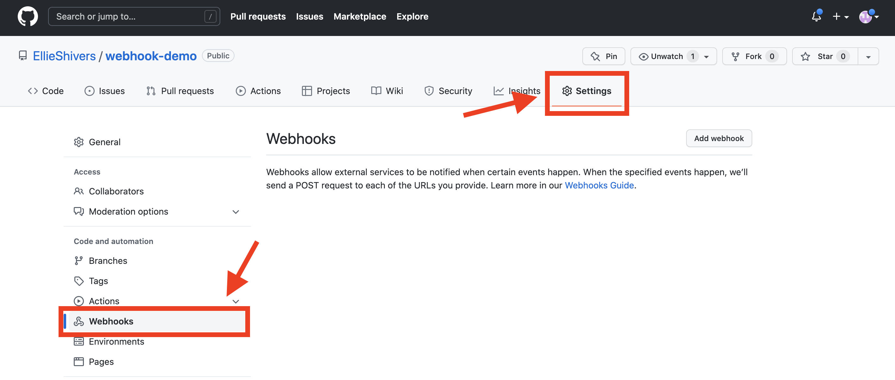
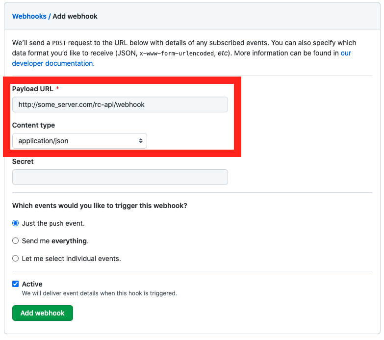
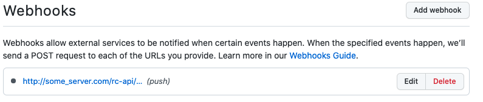
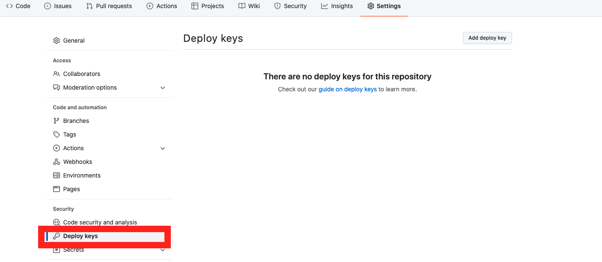
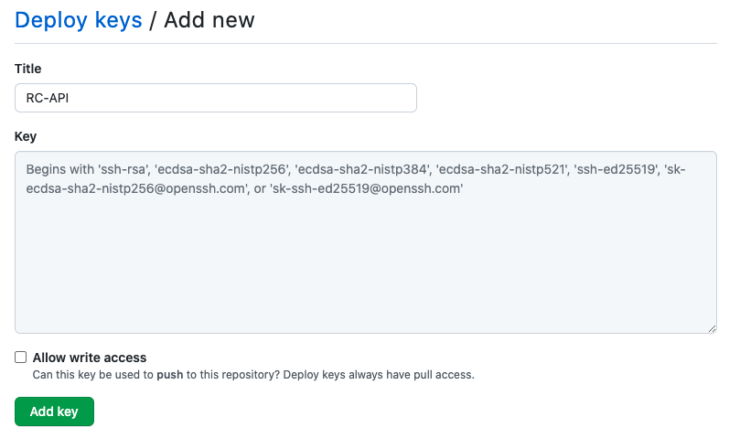

Knowledge-base Repository Configuration
=======================================

Getting Started
---------------

RC-API provides for a means to maintain script libraries through a continuous integration (CI) approach using a GitHub repository. This allows for the automatic loading of all libraries on startup as well as dynamic updates to libraries as they are pushed to a Knowledgebase Repository.

For general information on managing a Knowledgebase Repository, please see **LINK HERE**

The on startup integration is configured via environment variables in RC-API, whereas the continuous integration is handled through a webhook endpoint exposed in the API.

Please note that the instructions provided here are for a "generic" approach to configuring knowledge integration, and cannot account for all potential environments' security needs.

Requirements
^^^^^^^^^^^^

* A GitHub Repository
* RC-API

In addition to the above, you must have a way to generate (and potentially manage) SSH keys for RC-API if you intend to use a private or enterprise GitHub repository. (Public repositories do not require a key pair.)

RC-API Configuration Options
^^^^^^^^^^^^^^^^^^^^^^^^^^^^

The two parts of the loading, on startup and through continuous updates, are distinct areas of configuration. Users may choose one or both. This leaves four distinct knowledgebase integration configurations, as follows:

* No integration.
* Partial Integration - Startup Only
* Partial Integration - Webhook Only
* Full Integration - Startup and Webhook

Users should weigh their needs and security concerns with both approaches.

Startup Event Configuration
---------------------------

To load all CQL and NLPQL files from the knowledgebase repository on startup, the following environment variable must be set: ``knowledgebase_repo_url``. This should be the clone URL for the repository. It may be either in HTTPS or SSH such as "https://github.com/someorganization/cql-nlpql-knowledgebase.git" or "git@github.com:someorganization/cql-nlpql-knowledgebase.git".

For public repositories, this is all that is required. For private repositories, see the appropriate section below.

Webhook Configuration
---------------------

Configuring the webhook is slightly more involved. To begin, go to your knowledgebase repository. You will want to select "Settings" on the top, then "Webhooks" on the left from there as per the screenshot below.

From there, click the "Add Webhook" button on the top right of the body of this screen. You will be taken to the interface seen below.

There are two parts you need to change here, both inside the red box in the screenshot.
* The first is the Payload URL. This should be set to the "/webhook" endpoint at whatever location you deployed RC-API. For example, here is shown "http://some_server.com/rc-api/webhook", where "/rc-api/" is the base route of the API.
* You must also change the content type to "application/json".

Do not edit the events, it should only say "Just the push event". You are also not required to put in a secret, this feature is not implemented. Once you are done, click "Add webhook" at the bottom.

You should now see the newly added webhook in the list, as shown below.

Configuration for a Private Repository
--------------------------------------

When connecting to a private repository, regardless of which integrations you have opted to include, **you must use SSH to access GitHub and provide a private key to be usable by the RC-API deployment.** The public key in the key pair will then be configured as a Deploy Key in the github repository.

For the private key, this will depend heavily on your environment and cannot be fully accounted for here. For an insecure option for the sake of testing, continue on to the bottom of this section. This top portion will explain configuration of the GitHub repository's Deploy Key.

Setting up a Deploy Key
^^^^^^^^^^^^^^^^^^^^^^^

In the Knowledgebase repository settings, just below the webhook menu option, you will see "Deploy keys". Selecting this will have a screen very similar to the webhook one.

From here, click the "Add deploy key" button in the top right.

In this screen, give your deploy key a title such as "RC-API" to identify it, and then paste the **public** key into the provided text area. Do **not** select "Allow write access", this should remain unchecked. When done, click "Add key".

This configures your deploy key, so that an application with the matching private key may access the repository to perform read (clone) functions needed to pull the contents.

Insecure Testing Option
^^^^^^^^^^^^^^^^^^^^^^^

**WARNING!!** An insecure option for the sake of testing is provided here, but this *should not* be used with production environments, public repositories, or in any case where key security is important. The user assumes all risks for taking this approach.

If you are running the RC-API docker deployment, the private key along with a known_hosts file may be copied directly into the container. To do so, add the following lines to the Dockerfile found in the RC-API repository's ``/app`` folder, immediately following the line that says ``WORKDIR /app``. ::

   COPY ./ssh/id_rsa /root/.ssh/id_rsa
   COPY ./ssh/id_rsa.pub /root/.ssh/id_rsa.pub
   COPY ./ssh/known_hosts /root/.ssh/known_hosts
   RUN chmod 400 /root/.ssh/id_rsa

Then, still in the ``/app`` folder, create a new directory called ``/ssh``. Follow instructions for your OS to generate a key pair (e.g. ``ssh-keygen``), and place the resulting files in this folder along with a file called ``known_hosts``. To this file you will need to add the proper key for the repository host, typically GitHub.com. If you are using an Enterprise GitHub, you will need to obtain the known host key for that. The keys will not be provided here.
